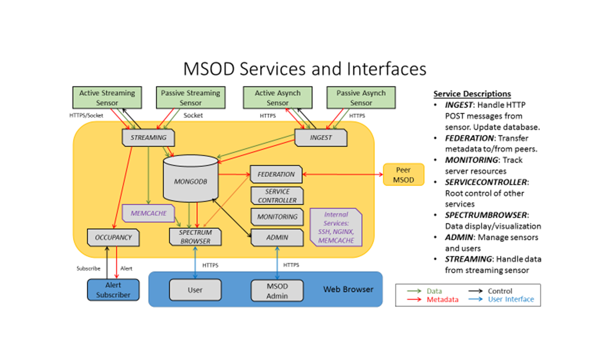

<h2> The DOC Spectrum Monitoring Project </h2>

The purpose of this project is to provide a web hosted database application and graphical tools
for recording and examining spectrum measurements.  The primary audience
for this project is researchers and policy makers who have an interest
in knowing how the spectrum is being utilized in various frequency bands
around the United States. Our initial focus is on the LTE and 3.5 GHz
RADAR bands.  A user of this project  will be able to pick a sensor and frequency
band of interest and explore the data readings recorded by the sensor. This repository contains
the server code. Related repositories publish the client (sensor) code.

This is a joint effort between NIST (CTL) and NTIA (ITS) - both agencies of the Department of Commerce.

<h2> Quick Tour </h2>

[A working server instance is running here](https://spectrum.nist.gov/spectrumbrowser)

<h2> Architecture / Implementation / Development/ Deployment </h2>

The MSOD Server consists of a number of services. The following diagram gives an overview of the
services and their functions:

Building: Please see [Building Notes](devel/building/README.md)

Deployment: Please see [Deployment Notes](devel/deploy/README.md)

Setup and Operation: Please see [Wiki Notes](https://github.com/usnistgov/SpectrumBrowser/wiki)

<h2> OPERATING SYSTEM </h2>

This is a linux project. It runs on a Centos 6.6 linux server. There
are no plans to port this to windows.

The code maturity level is "Beta". Testing testing and more testing
is needed. Please report bugs and suggestions for improvement. Use the
issue tracker on github to report issues.

<h2>Copyrights and disclaimers </h2>

 

This software was developed by employees of the National Institute of
Standards and Technology (NIST), and others. 
This software has been contributed to the public domain. 
Pursuant to title 15 Untied States Code Section 105, works of NIST
employees are not subject to copyright protection in the United States
and are considered to be in the public domain. 
As a result, a formal license is not needed to use this software.
 

This software is provided "AS IS."  
NIST MAKES NO WARRANTY OF ANY KIND, EXPRESS, IMPLIED
OR STATUTORY, INCLUDING, WITHOUT LIMITATION, THE IMPLIED WARRANTY OF
MERCHANTABILITY, FITNESS FOR A PARTICULAR PURPOSE, NON-INFRINGEMENT
AND DATA ACCURACY.  NIST does not warrant or make any representations
regarding the use of the software or the results thereof, including but
not limited to the correctness, accuracy, reliability or usefulness of
this software.

