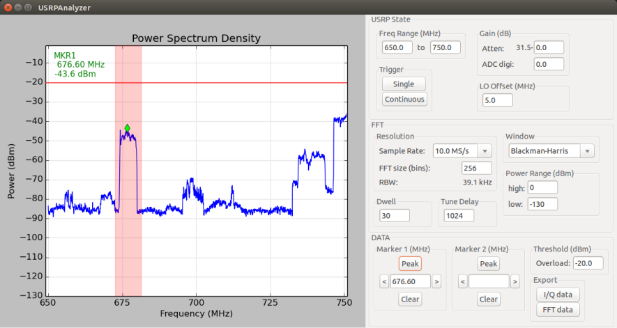

USRP Analyzer
=============

USRP Analyzer provides a spectrum analyzer-like graphical interface to
the USRP. It is build on
[GNURadio](http://gnuradio.org/redmine/projects/gnuradio/wiki) and
[SciPy](http://www.scipy.org/).



Key Features
------------

* Spectrum sweep capability
* Marker with global peak search
* Peak search in selected region (demo'd in screenshot)
* Output to log if user-selected threshold is exceeded
* Export raw and post-FFT I/Q data to Matlab file
* Custom blocks to:
  * linear average multiple passes
  * drop N samples from the stream after frontend retune
* Easily decouple GUI from processing code

Quick Start
-----------
1. Install GNURadio and UHD (recommend using [PyBombs](https://github.com/pybombs/pybombs))
2. Don't forget to `./pybombs env` and then `source setup_env.sh`
3. Install Python dependencies: `python-wxgtk2.8, python-scipy` (List may be incomplete)
4. Build and install custom blocks:
```bash
$ cd USRPAnalyzer/blocks/gr-usrpanalyzer
$ mkdir build && cd build
$ cmake -DCMAKE_INSTALL_PREFIX:PATH=~/YOUR_PYBOMBS_TARGET ../ && make all install
```

Navigate to the directory with usrp_analyzer.py and try `./usrp_analyzer.py --help` to see examples and options

Todo
----
 - [ ] Add facilities for time sample measurements (Sensor UI Requirements 3.0)
 
Known Issues
-----------
* To use sample rates above 25MS/s, we must change the USRP wire format from sc16 to sc8. Currently the ability to do this is implemented as a command line option. The GUI is also programmed to allow the change to be made on-the-fly, however, that ability does not exist in the UHD driver at this time. Martin Braun at Ettus is currently looking into adding this ability to UHD.

Support
-------
Douglas Anderson | NTIA/Institute for Telecommunication Sciences | danderson@bldrdoc.its.gov
